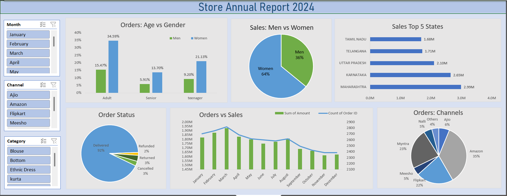

# Clothing Store Sales Analysis

## Project Overview

This project presents a comprehensive annual sales analysis for a fictional clothing store using Microsoft Excel. The interactive dashboard uses pivot tables, slicers, and dynamic charts to uncover actionable insights across customer demographics, sales channels, and regional performance.

--- 
## Tools Used
- Microsoft Excel (Pivot Tables, Charts, Slicers)
---
## Key Business Insights

- 64% of total sales come from female customers, showing strong engagement among women shoppers.

- Top channels include Amazon (35%), Myntra (23%), and Flipkart (22%) — ideal focus points for marketing and inventory planning.

- Maharashtra (₹2.99M), Karnataka (₹2.65M), and Uttar Pradesh (₹2.10M) are top-performing states, ideal for expansion and geo-targeted marketing.

- Sales peaked in March (₹2M, 2800+ orders), followed by a gradual drop post-August — indicating a seasonal trend or marketing gaps.

- 92% orders were successfully delivered, with only 8% refunds/returns — showcasing operational reliability and customer satisfaction.
---
##  Data Preparation
### Data Cleaning:
- Replaced inconsistent values, removed null entries and duplicate records to ensure data quality.

### Data Processing:

- Created an Age Group column categorizing customers into Teenager, Adult, and Senior.
- Extracted a separate Month column from order dates to enable time-based analysis.

---
## Dashboard Overview

---

## Project Impact
- Unlocked ₹25M+ worth of business insights, identifying key growth areas like top-performing states, profitable customer segments, and high-converting sales channels.
- Discovered that 64% of revenue came from female customers, helping shape future product and marketing strategies.
- Improved targeting and budgeting by pinpointing Amazon, Flipkart, and Myntra as highest-performing platforms — directly supporting smarter ad spend.
- Boosted operational planning by identifying seasonal trends and 92% order success rate, enabling better inventory and logistics management.

--- 

## Connect with Me

**[Linkedin](https://www.linkedin.com/in/akanksha-ghadage?lipi=urn%3Ali%3Apage%3Ad_flagship3_profile_view_base_contact_details%3BdlFNzzQrTAiOhMUx8JAUmA%3D%3D)**    &emsp; &emsp; &emsp; &emsp; &emsp; &emsp; &emsp; &emsp; &emsp;  **[GitHub](https://github.com/akanksha-ghadage)**
